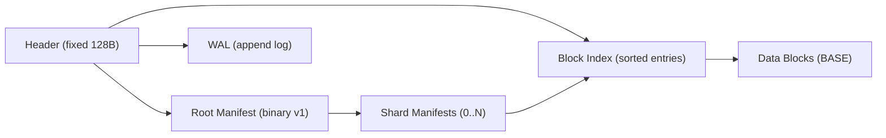
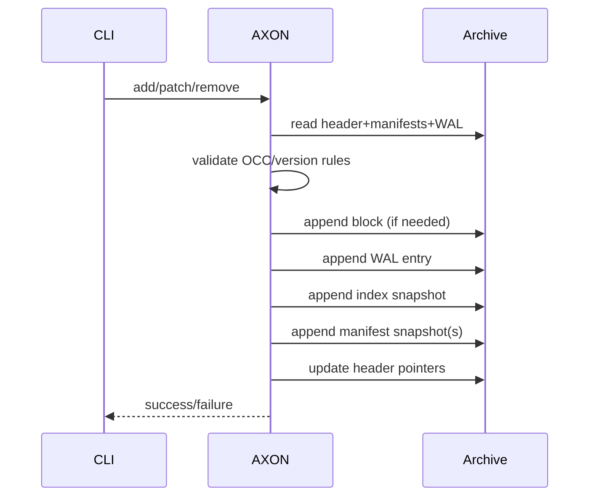
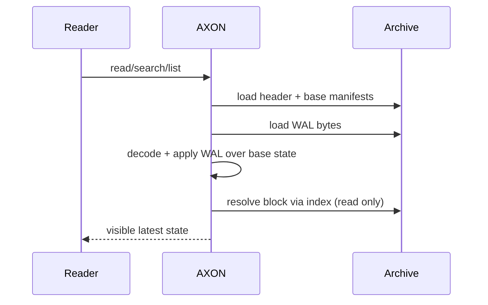
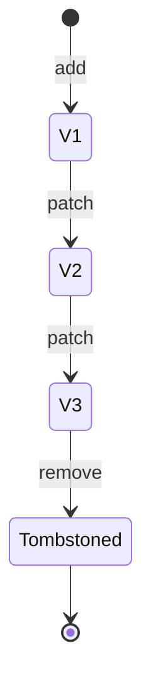
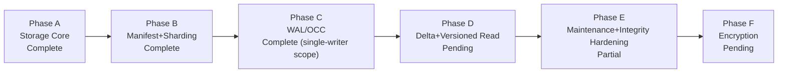

# AXON Whitepaper

Version: 0.1 Draft  
Repository: `/Users/arjun/Documents/Axon`  
Date: March 8, 2026

## Abstract

AXON is a structured archive format and CLI system designed for inspectable, incremental, and durable content storage. Unlike traditional monolithic archives, AXON treats archive mutation as an append-oriented, stateful process with explicit metadata structures for file identity, version progression, and integrity checks. The project targets workflows where archives are not static artifacts but evolving containers that must support direct reads, precise updates, and predictable recovery behavior.

The current implementation delivers a functional v0.1 foundation: block-level content storage, manifest-driven indexing, sharded metadata layouts, write-ahead log (WAL) persistence, optimistic concurrency checks, replay-based state recovery, and CLI primitives for verification and checkpoint compaction. This whitepaper defines the problem AXON addresses, its architecture, current guarantees, and remaining work toward production-grade operation.

## 1. Problem Statement

Most archive tools optimize for snapshot packaging, not long-lived mutation. This leads to several operational challenges:

- Updating one file often requires rewriting or rebuilding large artifacts.
- Recoverability after interrupted writes is implementation-specific and opaque.
- Version transitions are implicit, not first-class metadata.
- Archive internals are difficult to inspect without full extraction.
- Incremental verification and maintenance paths are limited.

AXON addresses these constraints through explicit metadata, append-based evolution, and bounded lookup structures that support direct read and mutation flows.

## 2. Design Goals

AXON is designed around the following priorities:

- Inspectability: metadata should be directly readable, queryable, and verifiable.
- Surgical mutation: add/patch/remove operations should avoid full unpack-repack cycles.
- Deterministic state: version and conflict behavior must be explicit and reproducible.
- Append safety: writes should evolve state through append-oriented commits.
- Bounded lookup: reading a file should require minimal traversal through indexed structures.
- Evolvability: format versioning should support migration from bootstrap encodings to stable binary layouts.

## 3. System Overview

An AXON archive is composed of:

- Header: fixed-size binary metadata (version, pointer offsets/sizes, checksums, counters).
- Data blocks: content-addressed block payloads (BASE currently implemented).
- Block index: sorted block-id to offset/size mapping for direct block resolution.
- Root manifest: top-level file/shard metadata.
- Shard manifests: optional partitioned file metadata segments.
- WAL: ordered mutation history entries supporting replay and recovery semantics.

The current implementation uses BLAKE3 content hashing for block IDs and binary v1 root/shard manifest codecs, with JSON read fallback for legacy bootstrap compatibility.

## 4. Data Model

### 4.1 Block Layer

Each stored block includes:

- `block_id` (32-byte content hash)
- block type and encoding flags
- raw/stored size fields
- payload bytes

Identical content deduplicates by block ID.

### 4.2 Manifest Layer

File metadata tracks:

- canonical path
- current block ID reference
- raw/stored size and algorithm
- per-file `version`
- `history_block_ids`
- `tombstoned` state

For larger file sets, manifest commits route entries into shard buckets using deterministic path hashing. Query commands (`search`, `list`) read metadata without touching data blocks.

### 4.3 WAL Layer

WAL entries persist mutation intent/result data including:

- operation type (`add`, `patch`, `remove`)
- target path
- expected version (optional OCC precondition)
- resulting version
- resulting block metadata (`block_id`, `raw_size`, `stored_size`, `algo`)
- tombstone state

Read/query state is resolved as: **base manifest state + WAL replay** (single-writer semantics in v0.1).

## 5. Mutation and Consistency Semantics

### 5.1 Single Operation Mutations

`add`, `patch`, and `remove`:

1. Validate request against current visible state.
2. Append new content block when needed (deduplicated if present).
3. Append WAL entry.
4. Append block index snapshot.
5. Append manifest snapshot(s).
6. Atomically advance header pointers to latest committed snapshots.

### 5.2 OCC Behavior

Current OCC includes:

- per-operation expected-version checks for `patch` and `remove`
- atomic multi-operation batch commit (`batch`) with all-or-nothing application

If any mutation in a batch violates expected version constraints, no changes are committed.

### 5.3 Replay Behavior

On open/read paths, WAL is decoded and applied over manifest baseline state. Replay logic enforces ordering rules and detects invalid version-state transitions.

## 6. CLI Surface (Implemented)

Core commands:

- `init`, `info`, `peek`
- `add`, `read`, `patch`, `remove`
- `search`, `list`
- `wal --status`
- `verify`
- `gc`
- `batch <plan.json>`

The CLI is intended as both user interface and executable specification of expected archive semantics.

## 7. Integrity and Maintenance

### 7.1 Verify

`verify` currently performs structural prechecks:

- header decode and pointer sanity
- region bounds validation (manifest/WAL/index/block entries)
- decode checks for referenced structures

This is a strong baseline but not yet a full deep consistency scanner.

### 7.2 GC Checkpoint

`gc` currently provides a checkpoint scaffold that:

- rewrites reachable blocks into a fresh archive snapshot
- rebuilds manifest/index snapshots
- folds WAL entries (clears compacted WAL in resulting archive state)

Further production hardening is still required (idempotency stress, orphan reclamation policies, compaction strategy tuning).

## 8. Security and Reliability Posture

Current posture:

- deterministic binary header + checksum validation
- explicit parse errors for malformed structures
- replay and verify safety checks to detect corrupt or inconsistent state

Not yet implemented:

- multi-process lock coordination
- encryption-at-rest (planned Phase F)
- advanced corruption recovery tooling

## 9. Testing Strategy

The project uses layered testing:

- unit tests for codecs and archive semantics
- integration-style CLI shell tests for end-to-end behavior
- regression tests for error paths (stale pointers, conflict detection, replay recovery)

Current repository status includes passing Rust tests and passing CLI bash suites for operational flows.

## 10. Current Status by Phase

- Phase A (Storage Core): complete
- Phase B (Manifest and Sharding): complete
- Phase C (Mutation Semantics incl. WAL/OCC): complete for current single-writer scope
- Phase D (Delta and Versioned Reads): pending
- Phase E (Maintenance/Integrity hardening): partial scaffolding
- Phase F (Encryption and Access Tiers): pending

## 11. Roadmap

Priority next steps:

1. Lock table + multi-process writer coordination.
2. Delta block support and versioned read/log workflows.
3. Deep integrity verification beyond pointer/decode prechecks.
4. Production-safe compaction and orphan reclamation.
5. Encryption tiers (mixed plain/encrypted content in one archive).

## 12. Conclusion

AXON has progressed from format concept to a functioning archival system with explicit metadata, durable mutation logs, replay-aware reads, and operational CLI workflows. The current implementation is a credible foundation for mutable archives in engineering workflows where observability, deterministic behavior, and incremental evolution matter. Remaining work focuses on concurrency hardening, historical/delta efficiency, and production-grade maintenance/integrity guarantees.
